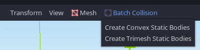

# Batch Collision Plugin for Godot 3.2.1

A plugin that automates the process of adding and updating collision shapes to meshes.
Select one or more MeshInstances and click on the `Batch Collision` button in the spatial editor menu:

You have the option of generating convex or concave static collision shapes.
